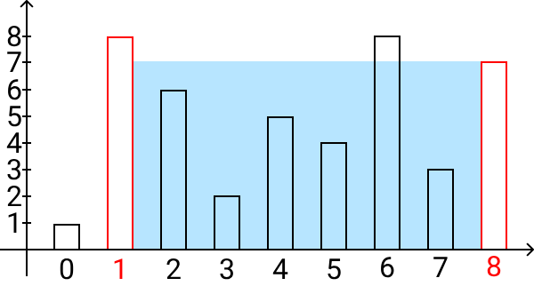

# Самый большой контейнер

#two-pointers #средне #яндекс

### Условие

Дан массив целых чисел nums, nums[i] – высота линии. Нужно найти максимальную площадь, которую может заполнить вода между двумя линиями.

ВАЖНО: площадь воды считается как min(nums[i], nums[j]) * (j - i), где i – индекс первой линии, а j - номер второй.

#### Примеры:



```
Ввод: nums = [1,8,6,2,5,4,8,3,7]
Вывод: 49
Объяснение: 7 * (8 - 1) = 49, "1" -  индекс первой линии, "8" -  второй
```

```
Ввод: nums = [2,3,4,5]
Вывод: 6
```

#### Ограничения

- len(nums) >= 2

### Решение

```Java
import java.util.*;

public class Solution {
    public int maxArea(List<Integer> height) {
        int p1 = 0, p2 = height.size() - 1;
        int max = 0;
        while (p1 < p2) {
            int curSum = (p2 - p1) * Math.min(height.get(p1), height.get(p2));
            max = Math.max(max, curSum);
            if (height.get(p1) > height.get(p2)) {
                p2--;
            } else {
                p1++;
            }
        }
        return max;
    }
}
```

Решение принято с первой попытки, время на все 9:30

### Ошибки

Ошибок при сдаче не было